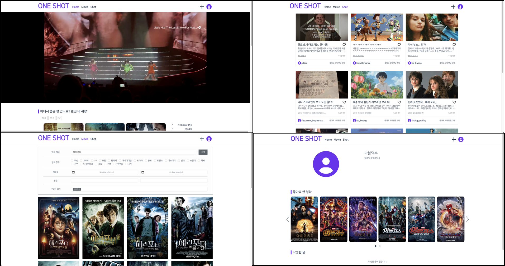
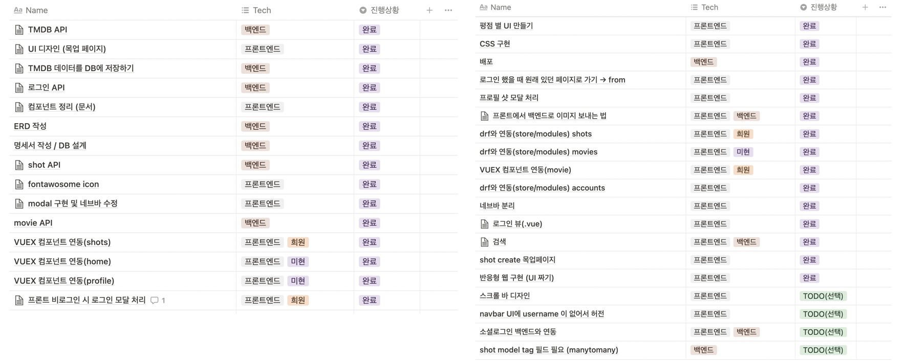
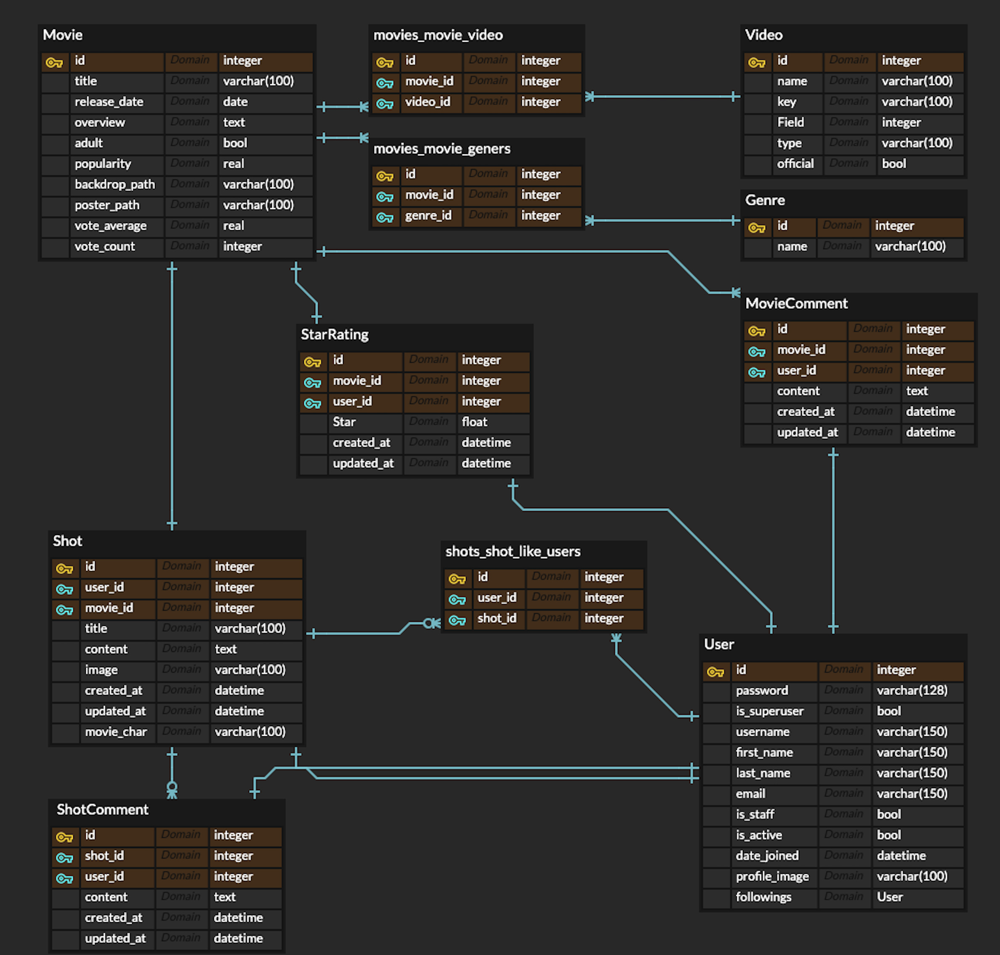

### 2022 Final Project

# ONE SHOT (영화 커뮤니티 사이트)

## 1. 배포 서버 URL

👉 https://one-shot.link/ 👈

## 2. 팀원 정보 및 업무 분담 내역

프론트엔드와 백엔드를 업무를 나누어 맡아 주도적으로 개발하되, 진행 상황에 따라 유동적으로 업무 분담을 했습니다.

* 황희원 - 프론트엔드 (Vue.js)
  * 프론트엔드 설계, Movie, Shot, Profile 페이지 & login, 회원가입 모달 구현
  * Movie REST API 기능 보완 (백엔드)
  * CSS 스타일링, 반응형 구현
  * Oven을 이용한 UI 설계 
* 이미현 - 백엔드 (Django)
  * TMDB API 이용한 데이터 추출 및 가공
  * 백엔드 DB 설계, Movie, Shot, Account REST API 구현
  *  Home, Movie detail 페이지 구현 (프론트엔드)
  * Netlify, AWS + S3 배포

## 3. 필수 기능 설명

1. 데이터베이스

   - TMDB API 를 활용하여 데이터를 수집, 가공하여 데이터베이스에 저장했습니다.

2. 영화 추천 알고리즘

   총 5개의 영화 추천 API 를 구현하였습니다.

   - 인기 영화 추천 : 인기도(popularity) 가 높은 영화 순서대로 추천합니다.
   - 최신 상영작 추천 : 이번달 상영작과 다음달 상영 예정작을 추천합니다.
   - 유저 데이터 기반 추천 : shot (게시글) 에 많이 태그된 영화순으로 추천합니다 .
     - '-shot_count' , 'vote_count__gt=100'
   - 평점 기반 추천 : 유저의 평점 데이터를 기반으로 선호하는 장르 3가지를 분석한 뒤 관련 영화를 추천합니다. 유저가 로그인 한 경우에만 홈화면에 보여집니다. 
     - '-vote_count', '-vote_average'
   - 영화 검색 및 필터링 : 영화 이름, 장르, 개봉일, 평점으로 영화를 검색할 수 있습니다. 
     - '-popularity', '-release_date', '-vote_average'

3. 영화 상세 페이지

   - 영화 상세 페이지에서 해당 영화에 대한 별점을 매길 수 있습니다. 평점 기반 추천 알고리즘에 사용됩니다.
   - 영화 상세 페이지에서 해당 영화에 대해 좋아요를 누를 수 있습니다. 좋아요를 누른 영화는 프로필 페이지에서 조회할 수 있습니다.

4. Shot (영화 커뮤니티)

   - 영화에 대한 유저의 감상평을 카드형식으로 보여줍니다. 게시글에 대해 댓글과 좋아요를 남길 수 있습니다. 작성한 글과 좋아요를 누른 글은 프로필 페이지에서 조회할 수 있습니다. 

5. 프로필

   - 다른 유저를 팔로우 할 수 있습니다.
   - 팔로워와 팔로잉 숫자를 볼 수 있습니다.
   - 좋아요를 누른 영화, 작성한 글, 좋아요를 누른 글을 조회할 수 있습니다.

## 4. 목표 서비스 구현 및 실제 구현 정도

기획부터 배포까지의 단계를 노션을 이용하여 기록하였습니다. 초기 목표치의 88% 를 달성했습니다. 

### [실제 구현 내용]

* 영화 추천 서비스 구현
* Git을 통한 형상관리 및 협업
* Vue.js 와 Django를 사용한 SPA + REST API 구현
* 영화 추천 알고리즘 개발
* shot (영화 커뮤니티) 개발
* 영화 검색 서비스 구현
* 회원가입, 로그인, shot 상세 페이지 모달 구현
* Netlify, AWS+S3를 이용한 배포

### [To do]

* 소셜 로그인
* shot (영화 커뮤니티) tag 검색 기능

## 5. 데이터베이스 모델링 (ERD)

## 6. 느낀점

* 황희원 : 수업을 들었을 때는, 뭐 이정도면 할 수 있지 않을까 생각했지만, 그건 저의 착각이었습니다. 하루 만에 쉽지 않구나를 깨닫고 미현언니와 함께 계획을 체계적으로 세우기 시작했습니다. Notion, Github, Oven 등 다양한 툴들을 처음 써봤던 터라 낯설었지만, 좀 지나고 나서 익숙해지는 저의 모습을 보며 개발자에 가까워지고 있다는 생각이 들어 기분이 좋았습니다. 이번 프로젝트를 하면서 뼈저리게 느꼈던 것은, 할 수 없는 일에 너무 오랫동안 매달리지 말자는 것입니다. 물론 포기하지 않는 정신도 중요하지만, 시간이 짧은 만큼, 선택과 집중이 굉장히 중요하다는 생각이 들었습니다. 그리고 프론트를 구현하면서 굉장히 세세한 부분에 집착을 하게 되었는데, 좋은 건지는 잘 모르겠다는 생각이 들었고, 이런 행동이 독인지 득일지를 알 때까지 개발해보고 싶다는 생각이 들었습니다. 앞으로 남은 기간동안 열심히 프로젝트를 해보고 싶습니다!
* 이미현 : 처음으로 기획부터 개발, 배포까지 완성해본 프로젝트라 기억에 많이 남을 것 같습니다. 일주일이 조금 넘는 시간동안 희원이와 함께 끊임없이 소통하며 의견을 나누고 일정을 조율했습니다. 열심히 했는데도 생각보다 결과가 나오지 않는 날들은 실망도 많이 했지만 그날 목표한 일정을 꼭 지키려고 노력했습니다. 짧은 일정이었지만 오히려 그렇기 때문에 백엔드와 프론트엔드를 모두 경험해볼 수 있었던 것 같습니다. 프로젝트 초반 목표 기능과 그에 관련한 DB 설계, Vue 컴포넌트 설계를 꼼꼼하게 하려고 노력했던 부분이 프로젝트를 진행하는데 많은 도움이 되었습니다. 시간 관계상 구현하지 못한 소셜 로그인과 태그 검색 기능은 나중에 다시 도전 해보고 싶습니다!

